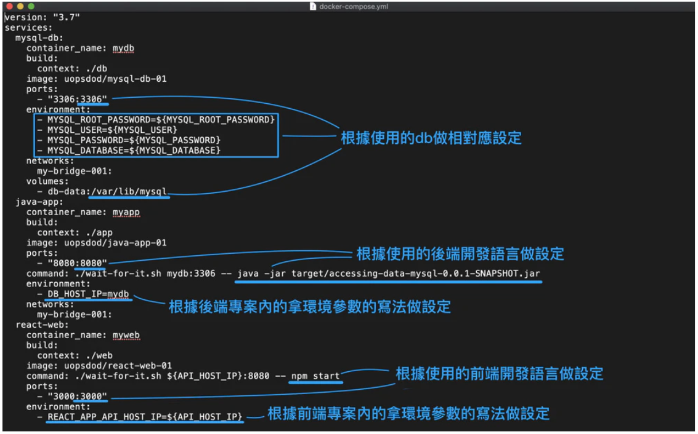

1. 額外說明-docker-compose build --no-cache:
    - --no-cache指令會跟docker daemon說不要使用本地已經有的image，而是去根據Dockerfile去製作全新的image來用
2. 額外說明-docker-compose.yml中哪些部分屬於「非」Docker本身設定：
    
3. 額外說明-CMD vs ENTRYPOINT：這兩個指令其實大多數情況互通，以下幫大家列舉幾個Dockerfile中功能相同的寫法：
    - ENTRYPOINT ["java", "-jar", "target/accessing-data-mysql-0.0.1-SNAPSHOT.jar"] (建議寫法)
    - ENTRYPOINT java -jar target/accessing-data-mysql-0.0.1-SNAPSHOT.jar
    - CMD ["java", "-jar", "target/accessing-data-mysql-0.0.1-SNAPSHOT.jar"]
    - CMD java -jar target/accessing-data-mysql-0.0.1-SNAPSHOT.jar

在影片中的docker-compose.yml，docker-compose command語法對照到Dockerfile CMD。我們也可以使用docker-compose entrypoint對照到Dockerfile ENTRYPOINT，同樣有著上述的四種寫法。

---

### 現在來一步步理解老師在docker-compose.yml裡面的元素

```yaml
version: "3.7"
services: 
  mysql-db:
    container_name: mydb  # 在針對myslq-db，要把這個container命名為mydb
    build:
      context: ./db  # 要build的source image為 ./db/ 下的 Dockerfile
    image: uopsdod/mysql-db-01
    ports: 
      - "3306:3306"
    environment:  # 這裡就是在這個folder裡面的隱藏檔 .env 裡面所定義的變數名稱
      - MYSQL_ROOT_PASSWORD=${MYSQL_ROOT_PASSWORD}  # 這些是初始化使用的，幫助我們建立第一個使用者和db
      - MYSQL_USER=${MYSQL_USER}
      - MYSQL_PASSWORD=${MYSQL_PASSWORD}
      - MYSQL_DATABASE=${MYSQL_DATABASE}
    networks:
      my-bridge-001:
    volumes:
      - db-data:/var/lib/mysql
  java-app:
    container_name: myapp
    build:
      context: ./app
    image: uopsdod/java-app-01
    ports:
      - "8080:8080"
    command: ./wait-for-it.sh mydb:3306 -- java -jar target/accessing-data-mysql-0.0.1-SNAPSHOT.jar 
    environment:
      - DB_HOST_IP=mydb
    networks:
      my-bridge-001:
  react-web:
    container_name: myweb
    build:
      context: ./web
    image: uopsdod/react-web-01
    command: ./wait-for-it.sh ${API_HOST_IP}:8080 -- npm start
    ports: 
      - "3000:3000"
    environment:
      - REACT_APP_API_HOST_IP=${API_HOST_IP}


networks:
  my-bridge-001:

volumes:
  db-data:
```

### 建立乾淨的測試環境

如果要建立乾淨的測試環境，則是將原本docker-compose.yml裡面的volumes給卸載掉。下面只列出與上面程式碼不同的地方：

**要把volumes的部份，全部從Dockerfile刪除掉才行。**

```yaml
version: "3.7"
services: 
  mysql-db:
    container_name: mydb  # 在針對myslq-db，要把這個container命名為mydb
    build:
      context: ./db  # 要build的source image為 ./db/ 下的 Dockerfile
    image: uopsdod/mysql-db-01
    ports: 
      - "3306:3306"
    environment:  # 這裡就是在這個folder裡面的隱藏檔 .env 裡面所定義的變數名稱
      - MYSQL_ROOT_PASSWORD=${MYSQL_ROOT_PASSWORD}  # 這些是初始化使用的，幫助我們建立第一個使用者和db
      - MYSQL_USER=${MYSQL_USER}
      - MYSQL_PASSWORD=${MYSQL_PASSWORD}
      - MYSQL_DATABASE=${MYSQL_DATABASE}
    networks:
      my-bridge-001:
#    volumes:
#      - db-data:/var/lib/mysql

#volumes:
#  db-data:
```


